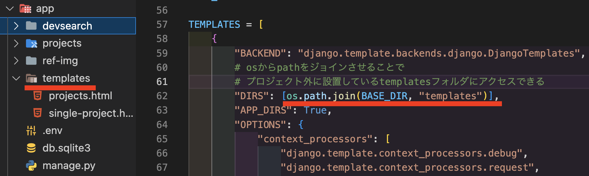

app用 readme

### hotreload & runserverコマンド
```bash
python manage.py livereload 

```

project外のtemplateフォルダの設定の仕方


テンプレートのdocs
https://docs.djangoproject.com/ja/4.2/topics/templates/


queryset object method
link[link](https://docs.djangoproject.com/en/5.0/ref/models/querysets/#queryset-api)
1. ModelName.objects.all()
2. ModelName.objects.get()
3. ModelName.objects.filter()
4. ModelName.objects.exclude()

__(ダブルアンダースコア)はQuerySetメソッドに対してどのカラムに対してどんな要素で情報を取ってくるかを意味している
```
>>> Entry.objects.filter(pub_date__lte="2006-01-01")
```
上記は下記のSQLと同等
```
SELECT * FROM blog_entry WHERE pub_date <= '2006-01-01';
```
「__lte」が詳細なデータのとってき方に相当している
query set チートシート
https://qiita.com/uenosy/items/54136aff0f6373957d22
https://zenn.dev/wtkn25/articles/django-field-lookups

チートシート
https://qiita.com/maisuto/items/bcdb0fd6c63cf0c544d6


フォームのカスタマイズを自由にするには??→'widget_tweaks'
https://hodalog.com/how-to-use-bootstrap-4-forms-with-django/

## テンプレート内での組み込みタグ一覧
projects.html内でのpluralizeから調べた内容
pluralize:valueが1でない場合に複数形を返すタグ
https://qiita.com/nachashin/items/d3f9cd637a9cecbda72c


## 別テーブルをリレーションしてそこからデータを引っ張ってくる方法
section6の Render Profilesでは表示させるProfileに紐づけているSkillをループで表示させている
その時の方法と注意点
1. models.pyで1対多の関係としてProfileと繋ぐ 
2. templateの方ではこんな感じ。.skillがリンクしているテーブル、_setを繋いで.allで全件取得
```html
    
    <span class="tag tag--pill tag--main">
        <small>{{skill}}</small>
    </span>
    
```
インスタンス名.モデル名_set.all()
「Django ForeignKey 逆参照 _set all」
- https://brhk.me/programing/django-foreignkey/
- https://chuna.tech/blog/web-application/Django/reference-foreignkey/
- https://daeudaeu.com/django-relation/


#### userの登録削除などをapp側にキャッチさせたい場合は、signals.pyで切り分けて書いた上で同じappでのapps.pyのclassの中に以下のdefを追記しないと信号をキャッチできない
```python
class UsersConfig(AppConfig):
    default_auto_field = "django.db.models.BigAutoField"
    name = "users"
    
    # signalをアプリにキャッチさせたいのであればappsのところに書く必要がある
    def ready(self):
        import users.signals
```


## 新規にページを追加するとき
1. templateでhtmlファイルを作成
   1. extendsでbase htmlファイルを読み込み
   2. blockで差し込みする部分とその中身を作る
      1. ここは初めは軽くでもOK
2. views.pyに新規のdefを作成
   
   1.  どこのhmtlファイルに飛ばすのかを設定
   ```python 
   def loginPage(request):
    render(request,'users/login_register.html')
   ```
3. urls.pyにpathを追記
   
   1. 
   ```python
   # loginの時にviews.pyのloginPageのdef見に行ってね
   path("login", views.loginPage, name="login"),
   ```
   2. チェック用
      1. kenji
      2. kkkkk123_

## フラッシュメッセージ
contrib > message
[message](https://docs.djangoproject.com/ja/5.0/ref/contrib/messages/)


### 追加でformを入れる時の手順(ページ作成から)
1. formを作るまでの下地作り
   1. templateフォルダでの表示させるhtmlを作る
   2. views.pyでそのtemplate htmlに飛ぶようにdefを定義
      1. まず初めはcontextは中身は空でいい
      2. ``` return render(request, "users/skill_form.html", context) ```
      3. loginしていることが必須の場合はちゃんと```@login_required()```をつけること
   3. 同じappフォルダのurls.pyでpathを定義
      1. ``` path("create-skill/", views.createSkill, name="create-skill"), ```
   4. 他のファイルから飛べるようにする場合はそのファイルのhrefをurlで書き換えて飛べるかチェックする
2. formの準備
   1. forms.pyで同じ階層のmodels.pyから使いたいclassがある場合、importする
      1. ``` from .models import Profile,Skill```
   2. そのforms.pyにてclassを新しく定義する
      1. class Meta:の記述も忘れずに！
   3. views.pyにさっきのforms.pyで新しく定義したclassをimportしておく
   4. views.pyで1.2で定義したdefの中でにformの情報を取得できるようにする
      1. ``` form = SkillForm() ```

### 前のページにgo backさせたい時
- 飛ぶ前のページのhtmlのaタグで以下のようなhrefの値にする
  - ```href=?next=/account ```
  - このようにnext=[ページの名前]とすることで、遷移先で``` {{request.GET.next}}```というhrefが使用できる